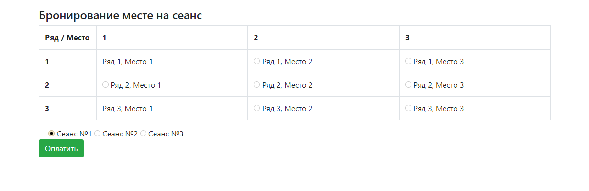
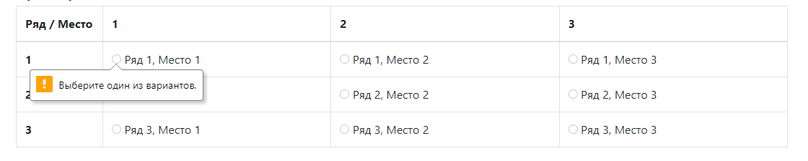
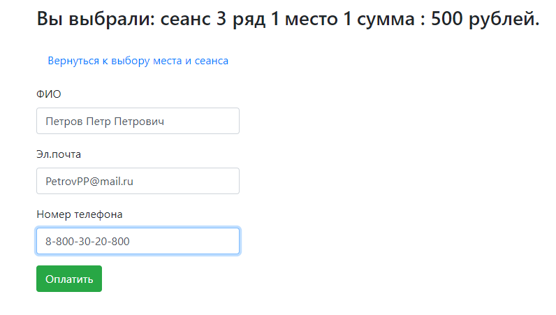
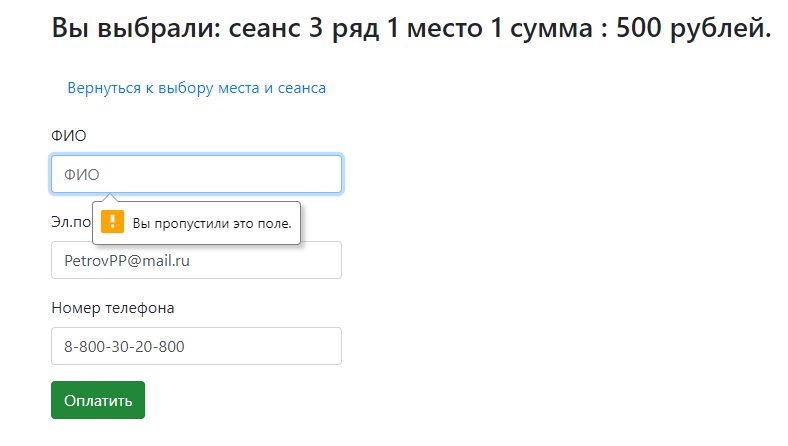
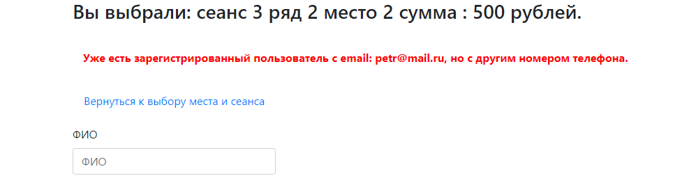
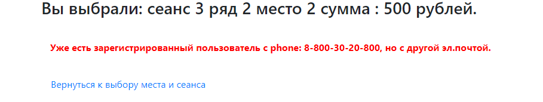
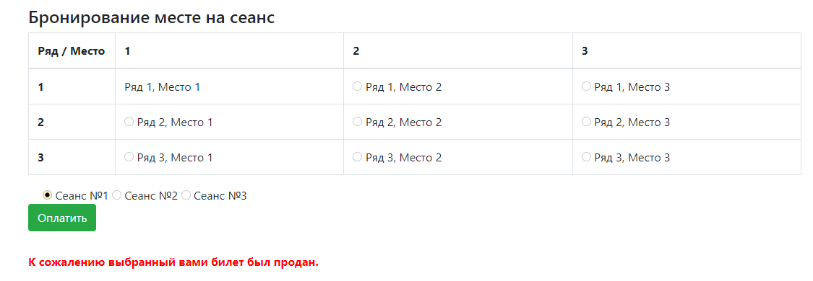

# job4j_cinema
Техническое задание - проект "Сервис - Кинотеатр"

На главной страницы, клиент выбирает сеанс(1-3) и место в кинотеатре(ряд/место).

Данные о занятых местах хранятся в БД Postgres SQL.
Обновление данных о занятых местах обновляется при загрузке страницы.
А также по таймеру каждые 30 сек.
Контролируется заполненность полей. Без выбора места и сеанса, переход форму с бронирования билета не будет.

Окно регистрации для отплаты билета.

Контролируется заполненность полей.

Если пользователя нет в базе, он сохраняется. Если есть, оставляем без изменений.
Также контролируется уникальность email+номер телефона.

Если выбранный билет не продан и корректно заполнена информации для регистрации, выведется финальное окно.

Если же билет был продан, будет перевод на окно с выбором сеанса и места.
С сообщением, что билет был продан.
